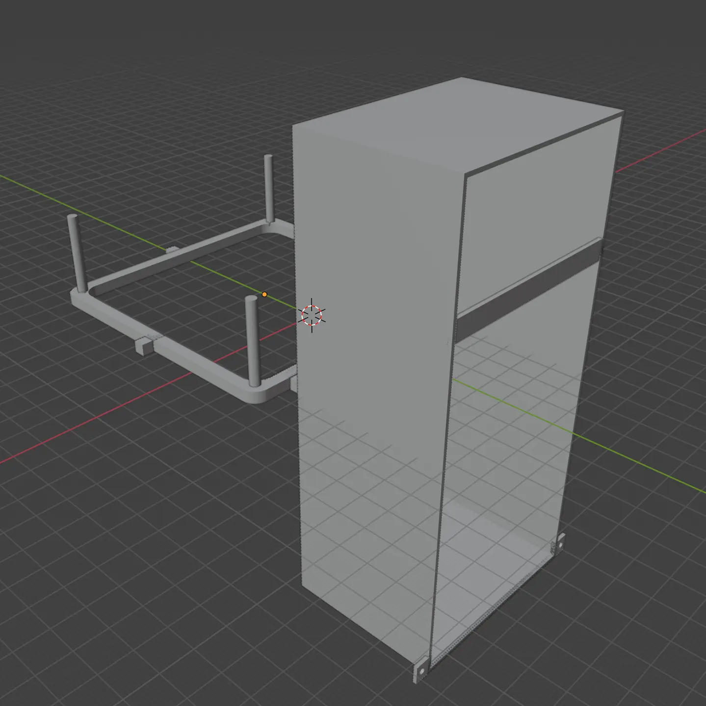
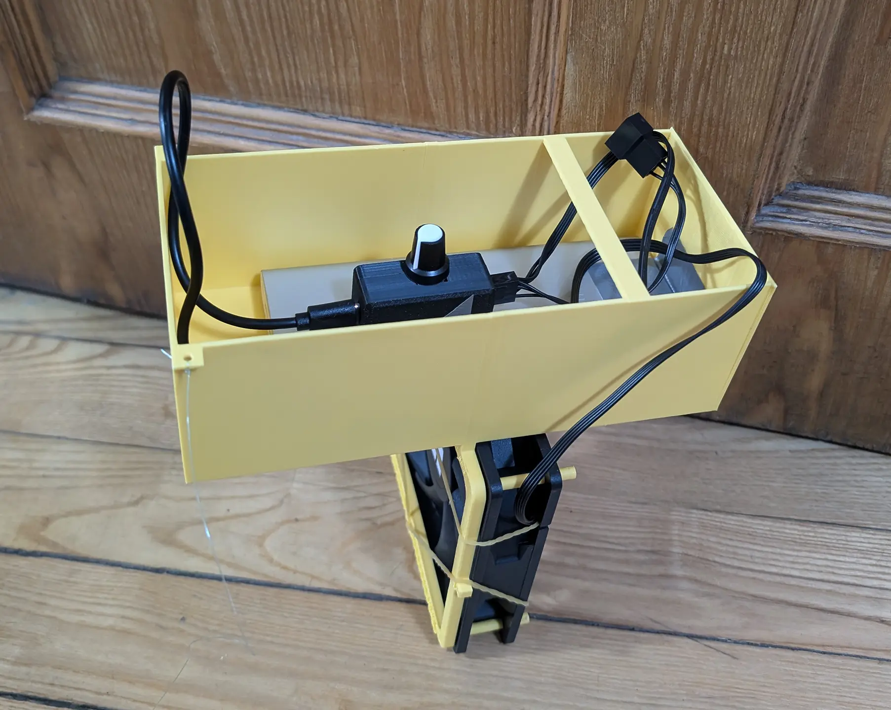
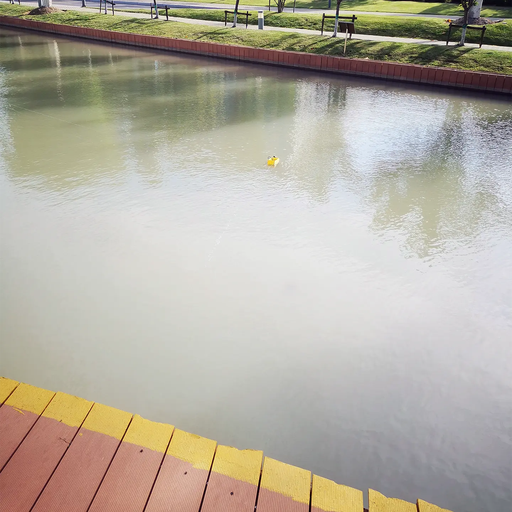

# 船！

大家装电脑的时候有遇到机箱风扇买多了的情况吗？

多余的机箱风扇又不值钱，自己去退货感觉挺麻烦的，放在家里又1直占地方。

好在聪明的莉沫酱发明了「船！」，这样1来你就可以把多余的风扇做成小船啦！

## 材料

- 机箱风扇。

- 充电宝。

- USB PWM调速器，这个淘宝有卖，大概10几块这样。

- 2条细线。

## 模型

这个模型是这样: 

- 右边是船的本体。
    - 把充电宝和PWM调速器放在里面供电，因为大家充电宝的形状都不太1样，所以没有设计固定的结构，直接放进去用胶带粘1下就可以了。
    - 然后它有2个耳朵，是用来把细线绑在上面的，这样下水以后可以手动控制方向。
- 左边的部分是风扇架子。
    - 可以固定1个12cm风扇，4个柱子刚好把风扇叉在上面，然后用橡皮筋固定1下就可以了。
    - 也有6cm风扇用的版本，但是6cm风扇居然卖得比12cm的贵，我也不知道为什么！

## 效果

打印出来之后，组装好是这样，应该这几个东西你们直接看图就知道怎么装，所以就没有安装步骤了:

看起来不错！

好，去公园试试:

嗯，看起来开得很平稳！

## 注意

- 风扇架的脚有时候会断，安装的时候不要太用力！

- 风扇为什么能在水里工作，这个我也不知道，但它确实可以……不过充电宝进水的话也不知道会怎么样，也许会爆炸？总之做实验之前要自己确保安全，被炸死了或者人掉到水里我也不会赔钱的！

- 用线控制方向不是很好用，如果把线绑在船头就很难操控，如果绑在船尾就没有办法掉头。所以应该还是要有3根线才行，这样它就可以自由转向了，但是人没有第3个手来拉线，我也不知道怎么办！

## 结束

就这样，大家88，我要回去给人添加手了！
